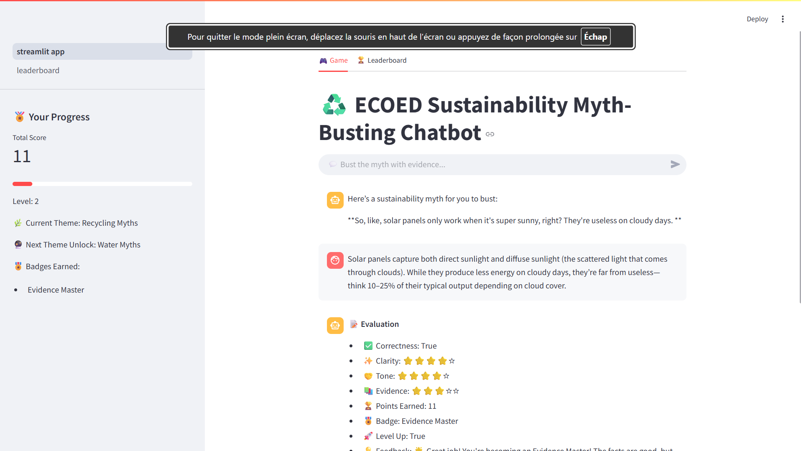

# ♻️ Sustainability Myth-Busting Chatbot

A gamified Streamlit web application designed to help users learn about sustainability by **busting common myths**.  
Users earn points, badges, and level up while receiving feedback on the correctness, clarity, tone, and evidence of their responses.  
The app includes a leaderboard for friendly competition.

> 🏫 This project was created during the **1st Edition of the Summer School for Enhancing Education through Gamification**.

---

## ✨ Features

- **Interactive Chat Game**: Users are presented with sustainability myths to correct.
- **Immediate Feedback**: Each response is evaluated and scored on:
  - ✅ Correctness  
  - ✨ Clarity  
  - 🤝 Tone  
  - 📚 Evidence  
- **Gamification**:
  - Points and levels
  - Badges for achievements
  - Sidebar progress tracking
- **Leaderboards**: Users compete and compare their scores.
- **Teacher Mode**: Predefined and AI-generated myths for testing.

---

## 📸 Demo

  
*(Replace with an actual screenshot once available)*

---

## ⚙️ Installation

1. Clone the repository:
   ```bash
   git clone https://github.com/yourusername/sustainability-chatbot.git
   cd sustainability-chatbot
2. Install dependencies
  ```bash
  pip install -r requirements.txt


